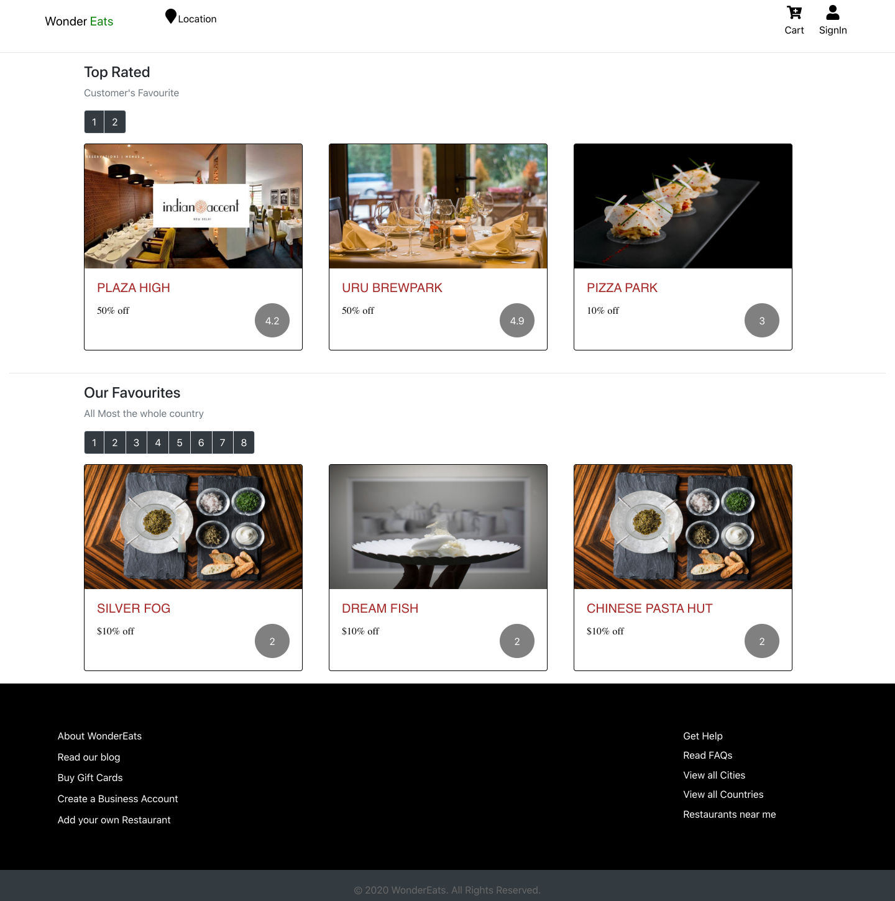

# food-delivery-system
A web application that allows users to order Food Online(Demo)
 
OverView:
Users can select their favourite restaurant and view the food items provided by them.
The user can select their favourite food and order it.
 
This Application is created using Create React App.
 

### Demo
https://wondereats.netlify.app/

### Screenshot

  

<h2>Installation<h2>
1.Clone the repo 
2.run npm install 
3.npm start 
